<!--
Hos to present this:
  presenterm docs/SLIDES.md

Controls:
  Space/→    Next slide
  ←          Previous slide
  q          Quit
  j/k        Next/previous slide
  g/G        First/last slide

For more: https://mfontanini.github.io/presenterm/

vim: noai:ts=2:sw=2 nofixendofline
vim: set autoformat=false
-->

<!-- end_slide -->

#   Why Dotfiles? 

<!-- pause -->

Ever had to set up a new Mac?

<!-- pause -->

Installing apps...

<!-- pause -->

Configuring settings...

<!-- pause -->

Tweaking preferences...

<!-- pause -->

**Hours** or even **days** of work

<!-- pause -->

What if it took **20 minutes**?

---

# 󰣆  Why I Do This

<!-- pause -->

It's the same feeling when you invest lots of time and effort to make automation...

<!-- pause -->

To make it **really nice**

<!-- pause -->

To make it **reproducible**

<!-- pause -->

To make it **intentional**

<!-- pause -->

> Is it practical? Maybe.
>
> Is it fun? Absolutely!

---

# 󰯈  The Old Way

```bash
# Install Homebrew
/bin/bash -c "$(curl...)"

# Install apps one by one
brew install git
brew install neovim
brew install --cask visual-studio-code
brew install --cask 1password

# Configure everything manually
# Click, click, click...
# Type, type, type...
# Copy, paste, copy, paste...
```

<!-- pause -->

> Repeat 50+ times 😭

---

# 󰳔  The New Way

```nix
# In one file: darwin/homebrew/common.nix
{
  casks = [
    "1password"
    "visual-studio-code"
    "obsidian"
    "firefox"
  ];
}
```

<!-- pause -->

```bash
darwin-rebuild switch --flake .
```

<!-- pause -->

**Done.**  󰙴  

---

# Infrastructure as Code

<!-- column_layout: [1, 1] -->

<!-- column: 0 -->

## For Servers

```hcl
# Terraform, Ansible, etc.
resource "aws_instance" "web" {
  ami           = "ami-12345"
  instance_type = "t2.micro"
}
```

**Why?**

- Reproducible
- Version controlled
- Testable
- Shareable

<!-- column: 1 -->

## For Your Mac

```nix
# Nix/nix-darwin
system.defaults.dock = {
  autohide = true;
  orientation = "left";
  tilesize = 48;
};
```

**Same benefits!**

- Reproducible
- Version controlled
- Testable
- Shareable

<!-- reset_layout -->

---

# 󰏖  What I Manage

<!-- pause -->

## System Level

- macOS preferences (Dock, Finder, keyboard)
- Security settings
- Fonts
- Services

<!-- pause -->

## User Level

- Shell (Zsh + Oh-My-Zsh)
- Git configuration
- Terminal (WezTerm + Zellij)
- Editor (Neovim/LazyVim)
- Window manager (AeroSpace)

<!-- pause -->

## Applications

- **170+** CLI tools via Nix
- **50+** GUI apps via Homebrew
- **Everything** version controlled

---

# 󰙴  The Magic: Nix

> [!note]
> Nix is a **purely functional package manager**

```mermaid +render +width:100%
graph LR
    Input[Same Inputs] --> Nix{Nix Build}
    Nix --> Output[Same Outputs]

    Nix --> |Atomic| Success[✓ Complete Success]
    Nix --> |Atomic| Fail[✗ Complete Rollback]

    Success --> Gen1[Generation 1]
    Gen1 --> Gen2[Generation 2]
    Gen2 --> Gen3[Generation 3]

    Gen3 -.->|darwin-rebuild --rollback| Gen2
    Gen2 -.->|darwin-rebuild --rollback| Gen1

    classDef inputStyle fill:#81a1c1,stroke:#88c0d0,stroke-width:2px,color:#eceff4
    classDef nixStyle fill:#5e81ac,stroke:#81a1c1,stroke-width:3px,color:#eceff4
    classDef successStyle fill:#a3be8c,stroke:#a3be8c,stroke-width:2px,color:#2e3440
    classDef failStyle fill:#bf616a,stroke:#bf616a,stroke-width:2px,color:#eceff4
    classDef genStyle fill:#88c0d0,stroke:#8fbcbb,stroke-width:2px,color:#2e3440

    class Input,Output inputStyle
    class Nix nixStyle
    class Success successStyle
    class Fail failStyle
    class Gen1,Gen2,Gen3 genStyle
```

<!-- pause -->



<!-- pause -->

**Key Features:**

- Reproducible: Same inputs → Same outputs
- Atomic: All or nothing operations
- Rollback: Time travel to previous states

---

# 󰍹  Three Machines, One Config

<!-- column_layout: [1, 1, 1] -->

<!-- column: 0 -->

## M3419

**Apple Silicon**

Work machine

<!-- column: 1 -->

## macmini01

**Apple Silicon**

Home server

<!-- column: 2 -->

## mbp01

**Intel Mac**

Old laptop

<!-- reset_layout -->

<!-- pause -->

**Shared configuration** + **machine-specific overrides**

<!-- pause -->

```nix
# common.nix - everyone gets this
packages = [git neovim kubectl];

# M3419.nix - only work machine
packages = [docker colima terraform];
```

---

# 󰸞  My Favorite Features

## 󰆍 Terminal Multiplexer (Zellij)

<!-- pause -->

Quick project switching: **Ctrl+b g** → FZF → Session

Works inside AND outside Zellij (consistent everywhere)

No more lost terminal sessions

<!-- pause -->

## 󰖟 Local DNS (dnsmasq)

<!-- pause -->

```bash
# In .envrc
use dns "dev.myapp.local"
```

<!-- pause -->

Automatically resolves to 127.0.0.1

Perfect for microservices development

---

# 󰸞  More Favorites

## 󰙨 Testing in Neovim (neotest)

<!-- pause -->

Run tests without leaving editor

Supports Jest, Vitest, Go, Python, Rust

Works with custom wrappers (sku, skuba) - requires customization

> IntelliJ still better out-of-the-box, but this is more fun to hack!

<!-- pause -->

## 󰊤 GitHub Dashboard (gh-dash)

<!-- pause -->

Manage PRs from terminal

One keystroke to review, merge, or checkout

Opens in Zellij session automatically

<!-- pause -->

## 󰔶 Terminal UIs (lazygit & lazydocker)

<!-- pause -->

**lazygit** - Beautiful Git UI in terminal

Stage, commit, push, rebase - all with keystrokes

No more memorizing Git commands

<!-- pause -->

**lazydocker** - Docker management made easy

View containers, logs, stats in one place

Nord-themed for visual consistency

---

# 󰒋  The Stack


---

# 󰌾  Security First

```mermaid +render +width:100%
%%{init: {'theme':'dark', 'themeVariables': { 'primaryColor':'#5e81ac','primaryTextColor':'#eceff4','primaryBorderColor':'#81a1c1','lineColor':'#88c0d0','secondaryColor':'#81a1c1','tertiaryColor':'#8fbcbb','noteBkgColor':'#3b4252','noteTextColor':'#eceff4'}}}%%
sequenceDiagram
    participant Dev as Developer
    participant Git as Git
    participant OP as 1Password Vault
    participant App as Application

    Note over Dev,OP: No Secrets in Git
    Dev->>Git: Commit code
    Git-->>Dev: ✓ No secrets stored

    Note over Dev,OP: Runtime Injection
    Dev->>App: Run command
    App->>OP: Request credentials
    OP->>OP: Decrypt from vault
    OP-->>App: Inject at runtime
    App-->>Dev: ✓ Authenticated

    Note over Dev,OP: Examples
    Note right of OP: • Git SSH signing<br/>• npm commands<br/>• AWS credentials<br/>• API keys
```



<!-- pause -->

> Same principle as cloud engineering:
> EKS secret mounting, K8s admission hooks, etc.

---

# 󰑓  The Development Workflow


<!-- pause -->

Everything themed with Nord 🎨

---

# 󰛨  Why This Matters

<!-- pause -->

## Time Saved

New Mac setup: **Hours** → **20 minutes**

<!-- pause -->

## Confidence

Know exactly what's installed

No surprises, no hidden configs

<!-- pause -->

## Learning

Configuration as documentation

See how everything connects

<!-- pause -->

## Sharing

This is mainly for me

But we can take inspiration from each other

Craft your own workflow to be productive

---

# 󰞷  The Crazy Parts

<!-- pause -->

> [!caution]
> I might have gone a bit overboard...

<!-- pause -->

- Custom Neovim config with **50+ plugins**
- DNS server for local development
- Git commit signing via 1Password SSH
- Custom overlays for bleeding-edge packages
- Zellij status bar with Nord theme integration
- Window tiling with AeroSpace
- Automated PR workflows in gh-dash

<!-- pause -->

**But it works beautifully!**  󰙴  

---

# 󰖷  Trade-offs

<!-- column_layout: [1, 1] -->

<!-- column: 0 -->

## The Good ✅

- Reproducible setup
- Version controlled
- Easy to experiment
- Rollback support
- Documentation built-in
- Cross-machine sync

<!-- column: 1 -->

## The Challenges  󰋗  

- Learning curve (Nix)
- Initial time investment
- Some manual steps remain
- Not everything is declarative
- Documentation upkeep
- Can be overwhelming

<!-- reset_layout -->

---

# 󰸞  Is It Worth It?

<!-- pause -->

## For Me: **Absolutely!**

<!-- pause -->

✅ 3 machines, perfect sync

✅ New Mac setup in 20 mins

✅ Safe to experiment

✅ Everything documented

✅ Learned a ton about Nix

<!-- pause -->

## For You?

<!-- pause -->

**If you:**

- Have multiple machines
- Reinstall often
- Love automation
- Enjoy tinkering
- Want reproducibility

<!-- pause -->

**Then yes!**  󰳔  

---

# 󰳔  Getting Started

```bash
# Clone the repo
git clone https://github.com/faizhasim/dotfiles.git
cd dotfiles

# Read the docs
cat docs/getting-started.md

# Install Homebrew manually
/bin/bash -c "$(curl -fsSL ...)"

# Install Lix
curl -sSf -L https://install.lix.systems/lix | sh -s -- install

# Apply configuration
sudo nix run ... nix-darwin -- switch --flake .#yourmachine
```

<!-- pause -->

📚 **Full docs at:** `docs/`

> Docs are extensive (LLM-generated)
>
> While I try to keep it "simple", use LLM agents to guide you as needed

---

# 󰱫  The Philosophy

<!-- column_layout: [1] -->

<!-- column: 0 -->

## 1. Infrastructure as Code

Everything version-controlled and reproducible

## 2. Modular Design

Separated concerns with clear boundaries

## 3. Pragmatic Approach

Using the right tool for each job

## 4. Security by Default

No secrets in code, 1Password integration

## 5. Developer Experience

Keyboard-driven, fast, and consistent

<!-- reset_layout -->

---

# 󰔶  Cool Details

## Nord Theme Everywhere

<!-- pause -->

Terminal, editor, status bar, even lazygit & lazydocker

Stylix automatically themes compatible apps

<!-- pause -->

## Hybrid Configs

<!-- pause -->

Some tools use Nix (automatic theming)

Others use raw configs (more control)

Best of both worlds

<!-- pause -->

## Consistent Session Manager

<!-- pause -->

**Ctrl+b g** works everywhere

Inside Zellij → Plugin

Outside Zellij → Shell FZF

Same muscle memory, different implementation

<!-- pause -->

Replicated Zellij's sessionizer in shell

Fast fuzzy finder for projects

One command to jump anywhere

---

# 󰖟  Real Example: DNS Setup

<!-- pause -->

**Problem:** Need `dev.myapp.local` → `127.0.0.1`

<!-- pause -->

**Old way:**

```bash
# Manual /etc/hosts editing
sudo vim /etc/hosts
# Add line: 127.0.0.1 dev.myapp.local
# Restart network
# Hope it works
```

<!-- pause -->

**New way:**

```bash
# In project .envrc
use dns "dev.myapp.local"
use dns "*.api.local"
```

<!-- pause -->

**Automatic:**

- dnsmasq configured
- macOS resolver created
- Cleanup on directory exit

---

# 󰙨  Real Example: Testing

<!-- pause -->

**Problem:** Run Jest tests in monorepo with custom wrapper

<!-- pause -->

**Old way:**

```bash
cd packages/my-package
yarn skuba test src/handlers/user.test.ts
# Wait...
# Scroll through output
# Find the error
# Go back to editor
# Fix it
# Repeat
```

<!-- pause -->

**New way:**

In Neovim:

- `<leader>tr` - Run test under cursor
- See results inline
- Jump to failure
- Fix it
- `<leader>tl` - Re-run

All without leaving editor!  󰳔  

---

# 󰈙  The Documentation

<!-- pause -->

## Comprehensive Guides

- Getting Started
- Architecture
- Configuration Guide
- Reference (gotchas & limitations)

<!-- pause -->

## Specialized Docs

- neotest.md - Testing setup
- dnsmasq.md - Local DNS
- opencode-agents.md - AI assistance

<!-- pause -->

## Living Documentation

Configuration **is** the documentation

See exactly how everything works

---

# 󰚩  AI-Assisted Development

<!-- pause -->

## Context7 Integration

Up-to-date library documentation

Efficient task execution

<!-- pause -->

## Custom Prompts

- Beast Mode 3.1
- GPT-5 extensive mode
- Context7-priority with memory

<!-- pause -->

## OpenSpec

Structured change proposals

Before diving into code

Prevents scope creep

---

# 󰏖  Package Management Strategy


<!-- pause -->

**Three layers, one cohesive system**

---

# 󰑓  Continuous Improvement

<!-- pause -->

## Monthly Updates

```bash
nix flake update
darwin-rebuild switch --flake .
```

<!-- pause -->

## Automatic Cleanup

Weekly garbage collection

Removes old generations (30+ days)

Keeps system lean

<!-- pause -->

## Easy Rollback

```bash
darwin-rebuild --rollback
darwin-rebuild --list-generations
```

Something broke? Go back in time!

---

# 󰇘  What's Next?

<!-- pause -->

## The Hardest Part?

The initial time investment to create your way of operating

<!-- pause -->

## But Once It's Done?

Just add and tweak things along the way

<!-- pause -->

## No Golden Standard

You won't find the perfect distro for this

It's all about **crafting your own experience**

<!-- pause -->

## Always Evolving

Nix ecosystem growing

New tools emerging

Your workflow maturing

---

# 󰄬  The Bottom Line

<!-- pause -->

## What Started As

Dotfiles repository

<!-- pause -->

## Became

Complete infrastructure-as-code system

<!-- pause -->

## With Benefits

- ⚡ Fast setup
- 🔄 Reproducible
- 📚 Documented
- 🔒 Secure
- 🎨 Beautiful
- 🤓 Fun to hack on

---

# 󰳔  Join the Journey

<!-- column_layout: [1, 1] -->

<!-- column: 0 -->

## Check It Out

```bash
github.com/faizhasim/dotfiles
```

## Read the Docs

```bash
docs/getting-started.md
```

## Try It Yourself

Fork it, customize it, make it yours!

<!-- column: 1 -->

## Share Your Setup

What are you automating?

What tools do you love?

Let's learn from each other!

<!-- reset_layout -->

<!-- pause -->

---

# 󰇥  Thank You

<!-- pause -->

Questions?

<!-- pause -->

**Let's talk about:**

- Your setup
- Pain points
- Automation ideas
- Nix, dotfiles, DevOps

<!-- pause -->

**Find me:**

- GitHub: @faizhasim
- This repo: github.com/faizhasim/dotfiles

<!-- pause -->

**Remember:** Your environment should work for you, not against you!  󰙴  ✨
